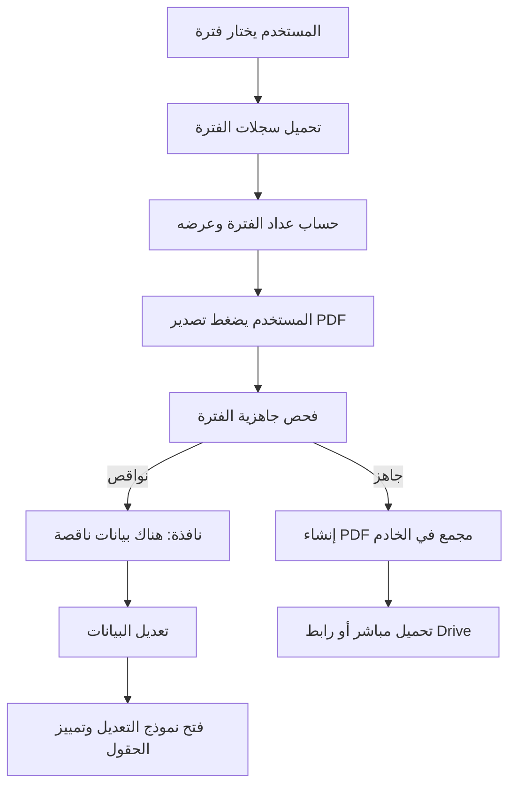

# تصميم تحسينات السجل والنواقص وتصدير PDF

## الهدف

تحسين تجربة مراجعة السجل والتصدير في منصة أثر بحيث تكون أكثر وضوحًا ورسمية:
تظهر النواقص بعبارة قصيرة، يمكن الانتقال منها مباشرة إلى تعديل الفعالية،
ويمنع النظام حفظ أي تعديل إذا بقي حقل مطلوب ناقصًا. كما يستبدل تصدير ZIP
بتصدير PDF واحد مجمع للفترة المختارة، مع عدادات صغيرة توضّح عدد الفعاليات في الفترات.

## النطاق

- واجهة السجل في `docs/app.js` ونسخة Apps Script في `src/JavaScript.html`.
- أنماط الأزرار والعدادات في `docs/styles.css` و`src/Stylesheet.html`.
- خادم Apps Script في `src/Code.gs` لإضافة تصدير PDF مجمع للفترة.
- اختبارات Node الحالية تحت `tests/` لتثبيت العقود السلوكية المهمة.

لا يشمل هذا التصميم تغيير بنية الجداول، أو تغيير صلاحيات المستخدمين، أو حذف تصدير Excel.

## التصميم البصري المعتمد

يعتمد السجل أزرار إجراءات هادئة وصغيرة بأيقونات مع Tooltip:

- عرض: أيقونة عين أو رمز عرض واضح، Tooltip "عرض".
- تعديل: أيقونة قلم، Tooltip "تعديل".
- طباعة: أيقونة طابعة، Tooltip "طباعة".
- حذف: أيقونة حذف هادئة بلون أحمر خفيف، Tooltip "حذف".

تستخدم أزرار العرض والتعديل والطباعة نفس اللون والحدود الهادئة لتقليل الزحام البصري.
يبقى الحذف مميزًا بالأحمر لأنه إجراء خطر، لكن دون حجم أو لون طاغٍ.
تكون الأزرار مربعة أو شبه مربعة بأبعاد ثابتة حتى لا يتغير تخطيط البطاقة بين السجلات.

## النواقص والتنقل إليها

تتغير رسالة جاهزية التقرير عند وجود نواقص مانعة إلى:

`هناك بيانات ناقصة`

تعرض النافذة قائمة الحقول الناقصة، وتضيف زرًا باسم "تعديل البيانات" عندما تكون النواقص
مرتبطة بفعالية محددة. عند الضغط عليه:

1. تغلق النافذة.
2. ينتقل المستخدم إلى شاشة تسجيل/تعديل الفعالية.
3. تفتح الفعالية مباشرة في وضع تعديل.
4. يتم تمييز الحقول الناقصة داخل النموذج.
5. ينتقل التركيز إلى أول حقل ناقص قابل للإدخال.

في تصدير فترة كاملة، تعرض النافذة السجلات التي تحتاج مراجعة. لكل سجل ناقص يظهر زر
"تعديل" ينقل إلى نفس مسار تعديل الفعالية ويمرر مفاتيح النواقص الخاصة بها.

## منع حفظ التعديل مع الحقول المطلوبة

يعامل حفظ التعديل مثل حفظ فعالية جديدة من ناحية الحقول المطلوبة:

- الحقول الأساسية تبقى مطلوبة دائمًا: النوع، العنوان أو اسم اليوم العالمي، تاريخ التنفيذ، والمنفذة.
- الحقول التي جعلتها الإدارة مطلوبة لاحقًا تصبح مانعة للحفظ عند تعديل سجل قديم.
- إذا كان عدد المستفيدين مطلوبًا وأصبح السجل القديم ناقصًا، لا يكتمل حفظ التعديل حتى يعبأ الحقل.
- إذا كان الحفظ المحلي أولًا نشطًا، لا يعرض التعديل وكأنه نجح عند رفض الخادم بسبب نواقص.

يستمر التحقق في طبقتين:

- الواجهة تمنع الحفظ مبكرًا وتبرز الحقول.
- الخادم يرفض الحفظ النهائي إذا وصلت بيانات ناقصة لأي سبب.

## تصدير PDF مجمع للفترة

يستبدل زر "تحميل ZIP" بزر "تصدير PDF". عند اختيار شهر أو ربع أو نصف سنة أو سنة:

1. تفحص الواجهة جاهزية الفترة بنفس منطق PDF الفردي.
2. إذا وجدت نواقص، تظهر رسالة "هناك بيانات ناقصة" مع قائمة السجلات وزر تعديل لكل سجل.
3. إذا كانت البيانات جاهزة، يستدعي العميل دالة خادم جديدة تنشئ PDF واحدًا يحتوي تقارير الفعاليات بالترتيب الزمني.
4. إذا كان الملف صغيرًا يرجع تحميلًا مباشرًا، وإذا كان كبيرًا يرجع رابط Drive احتياطيًا.

يستخدم الخادم نفس بناء صفحات PDF الحالي قدر الإمكان حتى تبقى الهوية الرسمية وقالب الخطاب
والصور متسقة مع PDF الفردي. إذا تجاوز عدد السجلات حدًا عمليًا، يعيد الخادم رسالة تطلب
اختيار فترة أصغر بدل محاولة تجهيز ملف ضخم قد يفشل داخل حدود Apps Script.

## عدادات الفترة

تظهر عدادات صغيرة قرب خيارات الفترة في شاشة السجل:

- عند اختيار شهر، يظهر عدد فعاليات ذلك الشهر.
- عند اختيار ربع أو نصف سنة، يظهر عدد فعاليات الفترة.
- يمكن إظهار العدادات داخل شريط صغير بعد اختيار الفترة، مثل: "فبراير: 7 فعاليات".

لا تحتاج العدادات إلى طلب خادم مستقل جديد في أول نسخة. يمكن حسابها من بيانات السجل
المحمّلة أو من المؤشرات الموجودة عند توفرها. إذا لم تكن البيانات محملة بعد، تظهر بعد انتهاء
تحميل السجل حتى لا تؤخر فتح الصفحة.

## تدفق البيانات

## الحالات والأخطاء

- لا توجد فعاليات في الفترة: تظهر رسالة واضحة ولا يبدأ التصدير.
- توجد نواقص مانعة: لا يسمح بتصدير PDF مجمع، وتظهر أدوات الانتقال للإصلاح.
- توجد ملاحظات غير مانعة: يمكن إظهارها مع السماح بالمتابعة حسب السلوك الحالي.
- فشل إنشاء PDF: تظهر رسالة "تعذّر إنشاء PDF" ويعاد تمكين الزر.
- رفض الخادم حفظ تعديل ناقص: تبقى الشاشة في وضع التعديل أو تعرض رسالة نقص واضحة، ولا يظهر نجاح كاذب.

## الاختبارات

- اختبار أن رسالة النواقص الجديدة موجودة في سكربتي الواجهة.
- اختبار أن أزرار السجل تستخدم فئات الأيقونات الهادئة وسمات Tooltip/aria-label.
- اختبار أن زر الفترة أصبح "تصدير PDF" ولا يظهر "تحميل ZIP" في الواجهة.
- اختبار خادم PDF المجمع بوحدة نقية أو بعقد نصي يثبت وجود الدالة الجديدة وحدودها.
- اختبار أن `missingRequiredFields_` و`missingFormFields` يغطيان الحقول المطلوبة في التعديل كما في الإضافة.

## معايير القبول

1. يرى المستخدم أزرار عرض/تعديل/طباعة/حذف كأيقونات هادئة مع Tooltip.
2. تظهر عبارة "هناك بيانات ناقصة" عند وجود نواقص مانعة.
3. يمكن الانتقال من نافذة النواقص إلى تعديل الفعالية الناقصة مباشرة.
4. لا ينجح حفظ التعديل إذا بقي أي حقل مطلوب ناقصًا.
5. يصدّر زر الفترة PDF واحدًا مجمعًا بدل ZIP.
6. يظهر عداد صغير لعدد الفعاليات في الفترة المختارة.
7. تمر اختبارات `npm test`.
